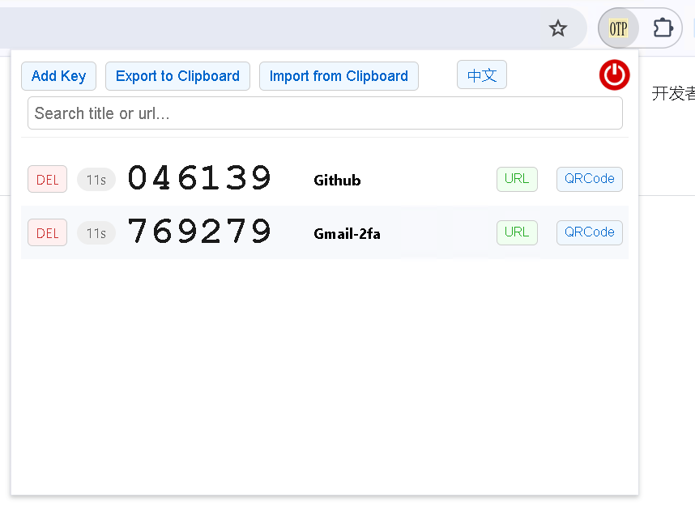
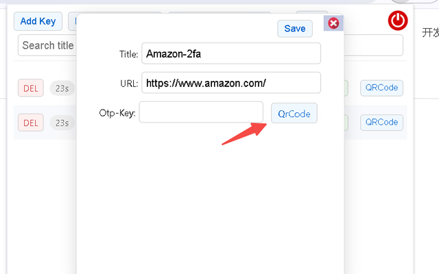
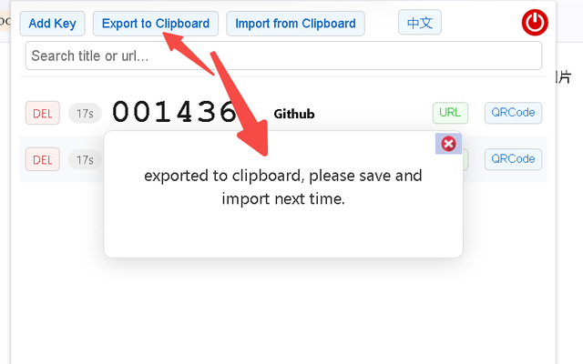
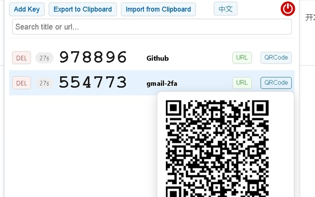
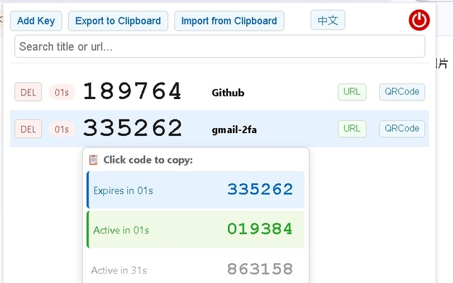

# beinetOtpExt — 2FA / OTP Authenticator Browser Extension

> 📖 中文文档请见 [README-cn.md](README-cn.md)

A lightweight Chrome / Edge extension (Manifest V3) that keeps all your 2FA TOTP secrets inside the browser. **No phone, no standalone app required** — generate and copy OTP codes right from the toolbar, import from QR images, and export back to your phone.

> Already published on the Edge Add-ons store (not on the Chrome Web Store only because the author didn't want to pay the registration fee — Edge is free):
> https://microsoftedge.microsoft.com/addons/detail/beinetotpext/ldnafnofjkedpacfpcekjlpbbecplepl

---

## Introduction

Two-factor authentication (2FA) codes usually rely on a phone app like Google Authenticator. But most of the time you're already sitting at your computer, and reaching for the phone is just friction — especially when it's charging or tied up in a VPN. This extension solves exactly that: **put your OTP secrets in the browser, click the toolbar icon, and see all your codes with one-click copy.**

It also tackles a few real-world pain points:

- **Code about to expire before you can paste it** — hover over a code and the popup shows both the *current* code and the *next* code, each click-to-copy.
- **Migrate from phone to desktop** — recognizes standard `otpauth://` QR codes, **and also the batch migration QR codes exported by the Google Authenticator app** (`otpauth-migration://`), importing multiple secrets at once.
- **Migrate from desktop to phone** — each secret can render its own QR code for a phone app to scan (e.g. when a phone-side VPN also needs the OTP).
- **Cross-device sync** — secrets live in `chrome.storage.sync`, so they follow your browser account automatically.

### Screenshots











---

## Features

| Feature | Description |
| --- | --- |
| TOTP generation | SHA1 / 6 digits / 30s period — compatible with Google Authenticator and other mainstream apps |
| Live refresh | Refreshes every second and shows remaining seconds for the current code |
| One-click copy | Click any code to copy it to the clipboard |
| Current + next code | Hover popup shows both codes side by side, each click-to-copy, so you're never caught out by an expiring code |
| QR import | Upload a QR image and the `secret` is auto-extracted from `otpauth://` |
| Google Authenticator batch import | Supports `otpauth-migration://` export QR codes, importing multiple secrets in one go |
| QR export | Generates a QR code per secret for a phone app to scan back in |
| Clipboard export / import | All secrets exported as text to the clipboard for backup or cross-device import |
| Site shortcut | Each secret can carry a URL — one click opens it in a new tab |
| Bilingual UI | Toggle between Chinese and English; the choice is remembered |
| Custom dialogs | Custom alert dialogs replace the browser's native `alert` for a consistent feel |
| ESC to close | Press Esc to dismiss any open dialog |

---

## Installation

### Option 1: Edge Add-ons store (recommended, easiest)

Click the Edge store link above and install directly.

### Option 2: Load from source (Chrome / Edge developer mode)

1. Download this repo (`git clone`, or download and unzip the ZIP).
2. Open `chrome://extensions` (Edge: `edge://extensions`).
3. Turn on **Developer mode** in the top-right.
4. Click **Load unpacked** and select the repo root (the folder containing `manifest.json`).
5. The extension icon appears in the toolbar — click to use.

---

## Usage

### Adding a key

1. Click the extension icon, then **Add Key**.
2. Fill in:
   - **Title**: a name for this secret (required).
   - **URL**: the associated website (optional; if set, a URL button appears for one-click open).
   - **Otp-Key**: the TOTP secret string (required, usually a Base32 alphanumeric string).
3. You can **type the secret manually**, or click **QrCode** to upload a QR image and auto-fill it.
4. Click **Save**.

### Generating and copying codes

- After adding, each row shows the live code and remaining seconds.
- **Click a code** → copies it to the clipboard.
- **Hover over a code** → a popup shows the **current code (blue)** and the **next code (green)**; click either to copy.

### QR import (including Google Authenticator batch export)

- In the add-key dialog, click **QrCode** and pick a QR image.
- Supported:
  - Standard QR codes from a site's 2FA setup (`otpauth://totp/...?secret=...`).
  - **"Export account" QR codes from the Google Authenticator app** (`otpauth-migration://offline?data=...`) — the protobuf payload is parsed and the first secret is filled in.
- After recognition, fill in the Title and Save.

### QR export (to a phone)

- Each row has a **QRCode** button on the right; hover it to pop up that secret's QR code.
- Scan it with a phone app (Google Authenticator, etc.) to import. Handy when the phone also needs the OTP (e.g. a phone-side VPN login).

### Backup & migration (clipboard export / import)

- **Export to Clipboard**: copies all secrets as text, one per line:
  ```
  title:secret|url
  ```
  (`|url` is omitted when there's no URL.) Paste it somewhere safe.
- **Import from Clipboard**: with that text in your clipboard, click this button; you'll be prompted with the count, then it writes them in. **Keys with the same title are overwritten.**

### Other

- **DEL**: delete a secret (with confirmation; not recoverable).
- **URL button**: opens the associated site in a new tab.
- **中文 / English**: toggle language; the choice is remembered.
- **Power icon** (top-right): closes the popup.
- **Esc**: dismisses any open dialog.

---

## Data Storage & Format

- Secrets are stored under the `key` field of `chrome.storage.sync` (synced across devices via the browser account):
  ```json
  {
    "Amazon": { "secret": "JBSWY3DPEHPK3PXP", "url": "https://amazon.com" },
    "GitHub": { "secret": "GEZDGNBVGY3TQOJQ", "url": "" }
  }
  ```
  Backward-compatible with the old format (value as a plain secret string).
- Global config (e.g. language) lives under the `configs` field.
- Export/import text format: `title:secret|url`, or `title:secret` when no URL — one per line.

---

## Security Notes

- **Minimal permissions**: only `clipboardRead`, `clipboardWrite`, and `storage` are requested — no network, no tabs, no host permissions. Apart from fetching the local language file `js/zh-CN.json`, the extension makes no network requests; secrets never leave your machine.
- **TOTP parameters**: standard SHA1 / 6 digits / 30s, fully compatible with Google Authenticator, Microsoft Authenticator, etc.
- **The sync trade-off**: `chrome.storage.sync` uploads secrets to the cloud under your browser account (for multi-device use). If you'd rather keep secrets strictly local, switch to `chrome.storage.local` (edit `setStorage` / `getStorage` in `popup.js`), or only use the extension in a browser profile with sync disabled.
- **Keep exports safe**: the clipboard export is plaintext secret material — it's a second-factor credential. Treat it like a password; never paste it anywhere public.

---

## Tech Stack & Project Layout

Plain HTML / CSS / JavaScript — **no build step, no dependency management**. Clone and load.

```
├── manifest.json          # Manifest V3 config
├── popup.html             # Extension popup UI
├── js/
│   ├── popup.js           # All business logic: TOTP, QR parse/generate, import/export, i18n
│   ├── otpauth.umd.min.js # TOTP computation library
│   ├── jsQR.js            # QR decoding library
│   ├── qrcode.min.js      # QR generation library
│   ├── base32.min.js      # Base32 encode/decode (for parsing Google export data)
│   └── zh-CN.json         # zh↔en translation map
├── img/                   # UI icons (close, power button)
├── one.png / one128.png   # Extension icons
└── otp1.png ~ otp3.png    # README screenshots
```

### Key implementation notes

- **TOTP generation**: `getCode(secret)` uses `OTPAuth.TOTP` with fixed SHA1/6-digit/30s; refreshed every second by `setInterval(refreshCode, 1000)`.
- **Next-code preview**: `getNextCode` temporarily overrides `Date.now()` to simulate the next period (popup preview only; doesn't affect the main flow).
- **Google Authenticator migration parsing**: `parseSecretFromGoogleAppExport` + `parseMigrationPayload` hand-roll protobuf varint decoding to extract name and secret from the base64 `data` of `otpauth-migration://`, then Base32-encode the raw secret bytes.
- **Duplicate-binding guard**: attributes like `bindclick` / `hover-bindclick` mark elements to avoid re-binding listeners when rows are added dynamically.

---

## Local Development

No dependencies to install — just load the source folder in your browser (see "Load from source" above). After editing `popup.js` or `popup.html`, click **Reload** on the extensions page to pick up changes.

---

## License

Open source — feel free to deploy and modify. Please preserve author attribution if you redistribute.
